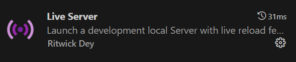

# Інструкції для запуску бекенду

Щоб запустити бекенд, слідувати цим крокам:

1. **Скачати проект**: Клонуйте репозиторій або завантажте архів з проектом на свій комп'ютер.

2. **Відкрити проект з редактора коду**: Відкрийте папку проекту у вашому обраному редакторі коду, наприклад, у Visual Studio Code.

3. **Встановити розширення Live Server**: У Visual Studio Code встановіть розширення Live Server для зручного запуску сервера.

   

4. **Запустити сайт з Live Server**: Після встановлення розширення, відкрийте головний HTML або PHP файл вашого проекту, натисніть праву кнопку миші та виберіть "Open with Live Server" для запуску вашого веб-сайту.

Тепер можливо запустити бекенд!

